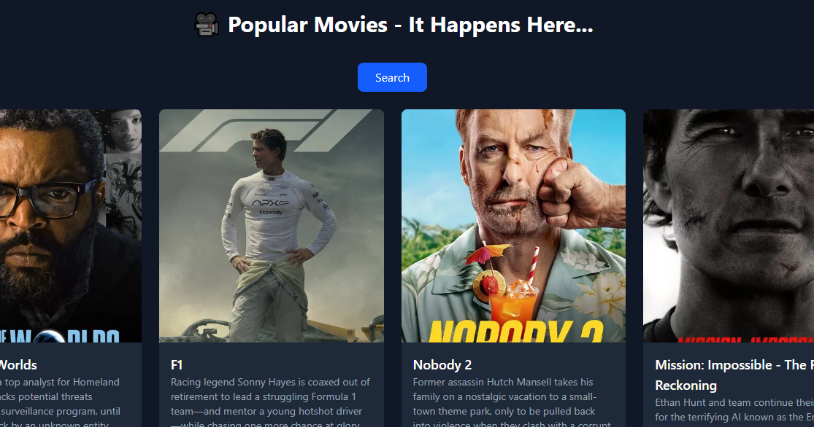

# 🎬 React Movie App


A modern and responsive movie browsing application built with **React.js** and **Axios**, powered by the **TMDb API**.  
Users can explore popular movies with real-time data fetched directly from TMDb on clicking the Search button.

---

## Features

- 🎥 Browse **popular** movies by clicking on the **search** button.
- 📖 View movie details including title, rating, release date, and overview.
- 🌐 Data fetched in real-time from [TMDb API](https://www.themoviedb.org/).
- 📱 Responsive design for desktop and mobile.

---

## Tech Stack

- [React.js](https://reactjs.org/) – Frontend framework  
- [Axios](https://axios-http.com/) – For API requests  
- [TMDb API](https://www.themoviedb.org/documentation/api) – Movie data provider  
- [CSS / TailwindCSS] – For styling  

---

## 📦 Installation & Setup

1. **Clone the repository**  

   ```bash
   git clone https://github.com/your-username/react-movie-app.git
   cd react-movie-app
Install dependencies

bash
Copy code
npm install
Set up your API key

Create a .env file in the root directory.

Add your TMDb API key:


📸 Screenshots
<p align="center"> </p>

📂 Project Structure
pgsql
Copy code
react-movie-app/
│── src/
│   ├── components/
│   │   ├─ MovieList.jsx
│   │   ├── App.jsx
│   ├── index.js
│── public/
│── assets/
│   ├─ movie-project.png
│   ├── search.png
│── .env
│── package.json
│── README.md


## Environment Variables
This project uses an API key from The Movie Database (TMDb).
Make sure you configure the following in your .env file:


## Acknowledgements
TMDb API for providing movie data

Axios for handling API requests

React.js
